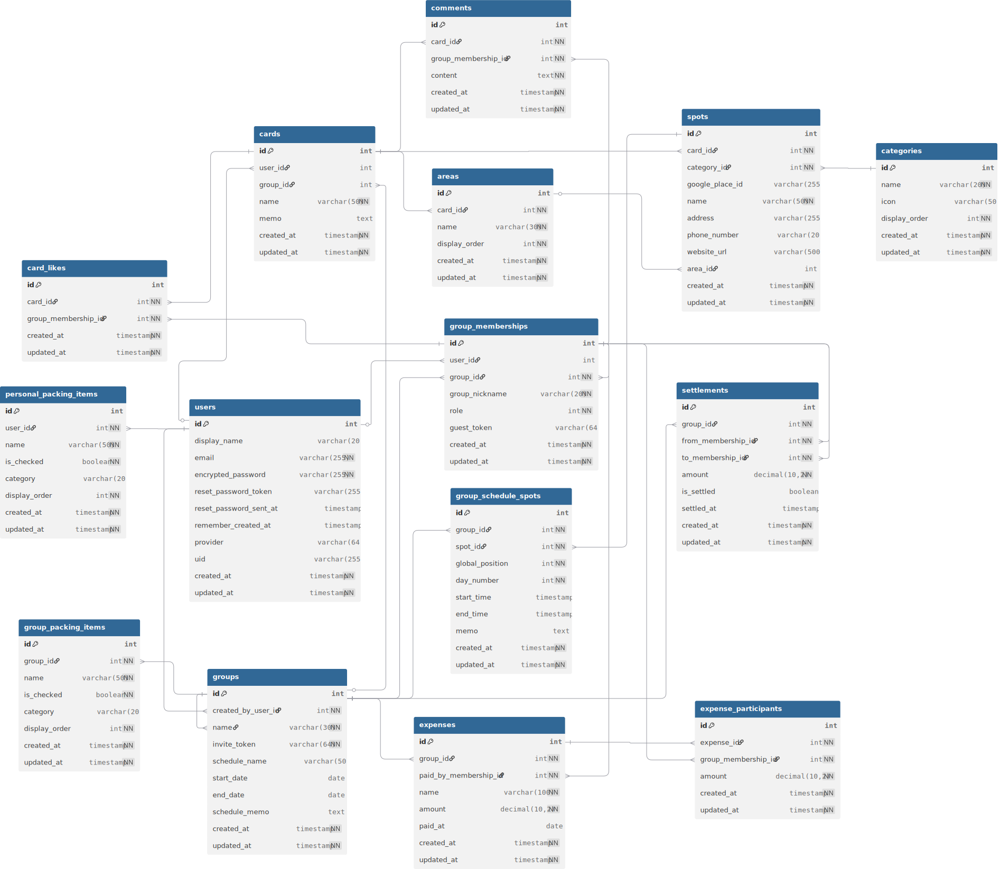

# RakuCi（ラクシィ）

## アプリ概要
RakuCiは、グループ旅行の計画をカンタンに進めることができるアプリです。 
旅行の目的地をカードにして検討を進め、行き先が決まったらしおりにまとめられるので、情報を整理し直す手間がなくなります。

## アプリURL
https://rakuci.com/
　

## お試しユーザーアカウント
- メール: rakuci-guest@sample.com
- パスワード: password

　
## 使用技術
| 項目 | 技術 |
| --- | --- |
| バックエンド | Ruby 3.3.6 / Ruby on Rails 7.2.2.2 |
| フロントエンド | Hotwire (Turbo 8.0.12 / Stimulus 3.2.2), Tailwind CSS 4.1.16 |
| データベース | PostgreSQL |
| 認証基盤 | Devise |
| 外部認証 | OmniAuth（omniauth-google-oauth2） |
| インフラ | Render |
| その他 | acts_as_list, rubocop, RSpec, factory_bot_rails |

　
## RakuCiで解決できること
- チャットに埋もれる候補地・リンクを拾い集める手間を減らします。
- 決まった内容をしおり用に書き直す／共有し直す二度手間をなくします。
- みんなの反応を把握し、合意形成までの時間を短縮します。

　
## 機能一覧
#### 旅行の行き先をカードにして、カードには行きたい場所（スポット）を追加できる
  - 行き先ごとに興味のある場所を整理できます（個人／グループでそれぞれ作成可能）。
  - 個人のカードには、TVやSNSなどで知った場所をストックすることができます。
#### グループを作成して、招待リンク経由でメンバーが参加できる
  - メンバーみんなで、行きたい場所を話し合い、カードやしおりを一緒につくることができます。
  - 招待されたユーザーは、ログインしないで利用することもできます。
#### グループ内で、いいね／コメントで反応を集めることができる
  - 合意形成を可視化できます。
#### 行き先が決まったら、しおりを作成して、旅行の詳細を計画していくことができる
  - カードのスポットをしおりに移行したり、しおりで直接スポットを追加することもできます。
#### もちものリストを個人用／グループ用で作成することができる
  - 個人用は、自分が毎回旅行に持っていくものをまとめておくことができます。
  - グループ用は、その旅行で必要になるものをみんなで共有することができます。
#### 旅行の費用をまとめて精算することができる（今後追加予定）

　
## 今後の追加予定
- 旅費の精算／割り勘機能
- コメントや投票のリアルタイム反映
- レスポンシブ対応
- UI/UXの向上

　
## ER図

詳細は、[dbdiagramファイル](dbdiagram)で確認できます

## 画面遷移図
- Figma: https://www.figma.com/design/YhWvCaj8tBoJYKhm43fk2L/%E7%84%A1%E9%A1%8C?node-id=1-76&t=HSSDe57bOePoMQmq-1
